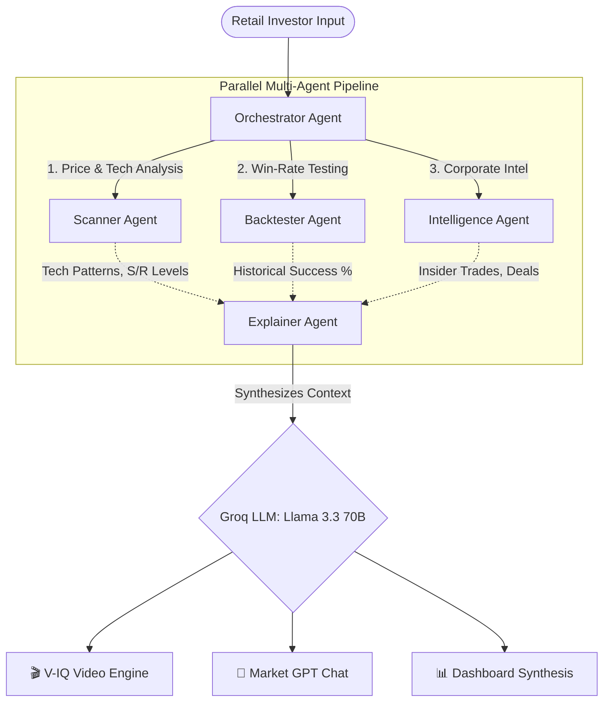

# PatternIQ ⚡

> **The Intelligence Layer for India's 14 Crore Retail Investors.**
> *A multi-agent AI platform built to transform raw market data into actionable, institutional-grade intelligence.*


---

## 🎯 The Problem

India has over **14 crore retail demat accounts**, yet the vast majority of investors are flying blind:
- Reacting to WhatsApp tips instead of data.
- Missing critical corporate filings and insider activity.
- Unable to read complex technical charts or understand indicators.
- Managing portfolios on gut feel, not intelligence.

**ET Markets has the data. PatternIQ builds the intelligence layer.**

---

## 🤖 What is PatternIQ?

PatternIQ is a **Conversational & Generative AI investment platform** powered by a parallel multi-agent architecture. When you search for an NSE stock, PatternIQ deploys specialized AI agents to analyze the ticker from every quantitative and qualitative angle, delivering the results in plain, actionable English.

### ✨ Core Features & Recent Upgrades

1. **Multi-Agent Intelligence Pipeline**: Connects real-time NSE data, 14 technical indicators, and simulated corporate signals (insider buying, bulk deals) into a single cohesive analysis.
2. **Dynamic Timeframe Switching**: Analyze stock charts across 5 interactive timeframes (**1D, 1W, 1M, 3M, 1Y**) seamlessly, adjusting indicators dynamically based on the selected period.
3. **Interactive Market GPT**: A portfolio-aware conversational AI. Ask it for precise entry points or stop-loss strategies. *Upgraded with quick-tap suggestion chips* so users never face a blank input.
4. **V-IQ Cinematic Video Engine**: Click one button to generate a broadcast-quality, 30-second video reel. An AI Voice Synthesizer reads a custom-written Market Wrap script compiled from the live data.
5. **NSE Opportunity Scan (Alerter Agent)**: A live scanner monitoring top NSE blue-chip stocks in the background to surface actionable medium/high-strength pattern breakouts.
6. **Real-Time Backtesting**: Every detected pattern is dynamically backtested against 2 years of historical data to show you its actual historical success rate.
7. **Premium, Responsive UI**: A fully styled, responsive "Deep Space" glassmorphism interface across all dashboard components for a competition-ready user experience.

---

## 🏗️ The Multi-Agent Architecture

PatternIQ relies on a highly modular framework orchestrated via **FastAPI** and powered by **Groq**.



### 1. Scanner Agent
Fetches real-time NSE price data via `yfinance`. Runs 14 technical indicator checks (MACD, RSI, Bollinger Bands, EMA Crossovers). Supports multiple timeframes (1D, 1W, 1M, 3M, 1Y) and automatically calculates support/resistance.

### 2. Backtester Agent
Tests every detected pattern against years of historical NSE data to compute real success rates: *"Bullish MACD Crossover worked 68% of the time on RELIANCE over 24 signals."*

### 3. Intelligence Agent (Opportunity Radar)
Scans for corporate intelligence signals: Bulk/Block deals on NSE, Director insider buying, SEBI clearances, and FII holding changes. Ranks signals by relevance (`critical`, `high`, `medium`).

### 4. Explainer Agent
Synthesizes all technical algorithms and corporate signals into a single readability-optimized paragraph. Provides a clear action (Buy/Sell/Wait) forming the core context layer for the interactive chatbot.

### 5. Alerter Agent
Handles the NSE Opportunity Scan by autonomously processing a watchlist of top blue-chips, alerting on emerging technical and corporate developments in the background.

---

## 🛠️ Technology Stack

| Layer | Technology |
|:---|:---|
| **Frontend** | React + Vite, Recharts, Lucide Icons |
| **Backend** | Python, FastAPI, WebSocket Support |
| **AI / LLM** | Groq API (`llama-3.3-70b-versatile`) |
| **LLM Framework**| LangChain (`ChatGroq`) |
| **Market Data** | `yfinance` (Real-time & Historical NSE Data) |
| **Tech Analysis**| TA-Lib (`ta`), Pandas, NumPy (14 indicators) |
| **Styling** | Vanilla CSS (Deep Space Glassmorphism, Neon Accents) |
| **Audio Output** | Web Speech API (`SpeechSynthesisUtterance`) |

---

## 🎨 Design Philosophy

PatternIQ uses a **"Deep Space" premium design** system:
- **Dark glassmorphism** cards with frosted glass effects.
- **Neon accent palette**: Electric Blue (`#38bdf8`), Electric Indigo (`#818cf8`).
- **Agent Intelligence Trail**: Real-time terminal log of every AI agent's activity.
- Fully responsive styling ensuring seamless mobile and desktop experiences.

---

## 🚀 Getting Started

### Prerequisites
- Node.js (v18+)
- Python (3.10+)
- A free API key from [Groq](https://console.groq.com/).

### Backend Setup
```bash
# Navigate to the backend directory
cd backend

# Create and activate a virtual environment
python -m venv venv
source venv/bin/activate  # On Windows: .\venv\Scripts\activate

# Install dependencies
pip install -r requirements.txt

# Create a .env file and add your Groq API Key
echo GROQ_API_KEY="gsk_your_api_key_here" > .env

# Run the FastAPI server
uvicorn main:app --reload --port 8000
```

### Frontend Setup
```bash
# Navigate to the frontend directory
cd frontend

# Install dependencies
npm install

# Start the development server
npm run dev
```

Visit `http://localhost:5173` to interact with PatternIQ!

---

## 🔮 Roadmap / Scaling to Production

PatternIQ is built to easily snap into enterprise data lakes:
- **Corporate Filings:** Replace local simulations with direct NSE Announcements API / SEBI RSS Feeds.
- **Bulk/Block Deals:** Digest the daily NSE Bulk Deal CSV.
- **Management Commentary:** Ingest live earnings call transcripts (e.g., via Screener or TickerTape integrations).

---

*Built with precision for the ET Gen AI Hackathon.*
